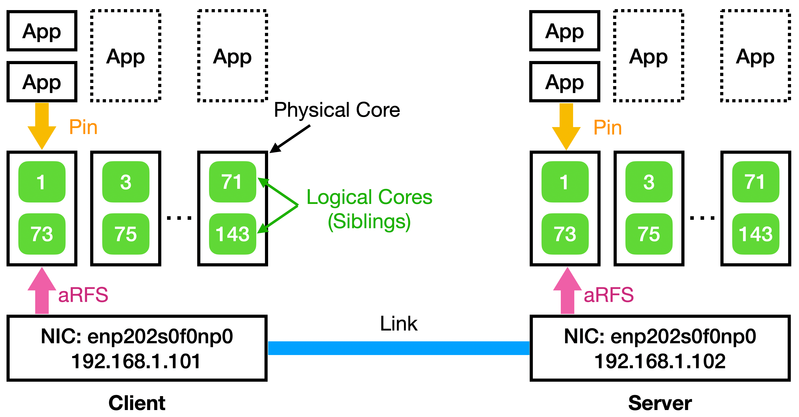
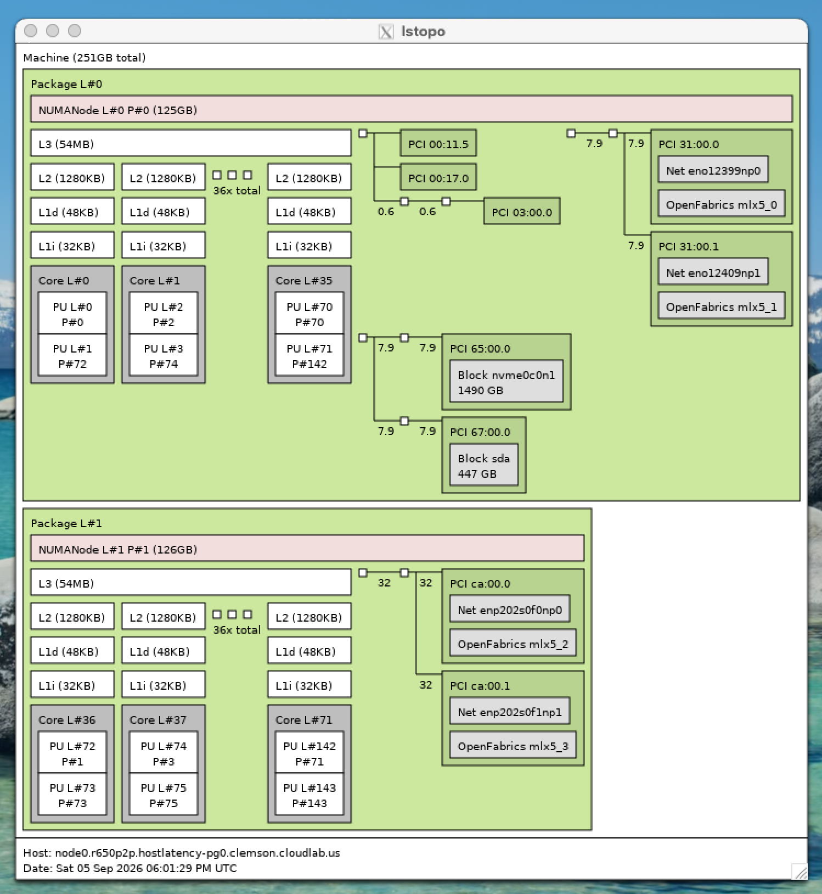

# Understanding Host Network Stack Latency — Experiment Set

Experiment set for our SIGCOMM '2026 paper "Understanding Host Network Stack Latency"

## Prelude
Note: This experiment set is not essential to understand the Linux network stack latency. Actually, with our [customized Linux kernel](https://github.com/Terabit-Ethernet/linux-latency), you should be able to run the latency analysis on any desired workload. This experiment set works as the reference point.

Note: we provide essential data analysis tools in `parse` folder **as reference**; it's extremely difficult for us to provide end-to-end (figure level) analysis tools since the experiment results may vary across different hardware configuration.

## Hardware Requirement

There are two hardware requirements: 
1. You must use an x86/64 CPU if you want to use the PMU programming module of ours --- You will also have to change the PMU event if you are using non-Intel CPU.
2. You must use an Mellanox NIC, since we rely on `mlx5e` driver instrumentation to report the recorded timestampes through ftrace framework.

We have used the follwing hardware and software configurations for running the experiments.

* CPU: 2-Socket Intel Xeon Gold 6530
* RAM: 1024 GB
* NIC: Mellanox ConnectX-7 (400 Gbps)
* Distro: Ubuntu 22.04
* Others: gcc/g++ 11.4.0 and GNU Make 4.3

## Software Requirement
You must uninstall all active OFED driver for NIC in your system since we rely on kernel's in-tree mlx5e driver to report the recorded timestamps when finally injectign the packet to the link.
Please refer to [NVIDIA](https://networking-docs.nvidia.com/mlnxofedswum/24.10-5.1.6.1lts/uninstalling-the-driver) for how to uninstalling OFED drivers.

Install the essential software:
1. We rely on `hwstamp_ctl` and `phc2sys` to sync time between CPU and NIC, and read NIC's hardware timestamp.
1. We rely on `sar` for CPU utilization monitoring.
1. We rely on `trace-cmd` for resetting ftrace buffer.
```sh
sudo apt update
sudo apt install linuxptp sysstat trace-cmd
```

The expeirment requires `numpy` for data processing, and `matplotlib` for essential plotting:
```sh
wget https://bootstrap.pypa.io/get-pip.py
python3 get-pip.py
python3 -m pip install numpy
python3 -m pip install matplotlib
```

## Kernel Installation

Please refer to https://github.com/Terabit-Ethernet/linux-latency for kernel installation. In this document, we will explicitely denote which kernel is required for each set of experiments.

Note: We recommend duplicate the clone for different kernel version since kernel compiling could be very slow, and we need to switch between different kernels. You MUST build separate kernel images for each machine. The latency monitor is keyed to the host's own IP address, which is hardcoded at compile time.

We assume we have two kernel: one is the default (e.g., 5.10.46-default), and one is for IRQa, ACCa, and PCSched (e.g., 5.10.46-latency), which are switched by runtime parameters.

## Artifact Evaluation Guide
Important: the experimental results from artifact evaluation may differ significantly from that in our paper due to hardware differences. To fully reproduce the results in our paper, we recommend using exactly the same hardware (i.e., CPU, RAM, and NIC); that said, due to potential export control and policy issue, we were unable to provide access to our own servers.

### (Optional) CloudLab Setup
To facilitate the artifact evaluation, we recommend using the [**r650**](https://docs.cloudlab.us/hardware.html#(part._cloudlab-clemson))) type server from CloudLab. Our experiment scripts and settings in this section will also be based on r650 server.

Important: Different servers may have, most importantly, the CPU siblings mapping. If you are running experiments in other type servers, please make sure to prepare the applications correctly, following the instructions.

The experiment will generate significant amount of data. In this artifact evaluation guide, we mount the `nvme0n1` NVMe as `/data` to store all experiment output. We omit the NVMe mount setting steps (ChatGPT should help!). If you are using a different experiment environment, you should change the output directory in the experiment script.


### Experiment Diagram

<p align="center">
  
</p>

The diagram shows the CPU layout, NIC interface and IP address for this evaluation guide based on r650 machines.

### Kernel Preparation
Note: do this in both server, with potentially different hardcoded parameters.

We assume you have installed the kernel and drivers as we instructed before. We should have two kernel in `/boot`:
1. `5.10.46-linux+`: This is the default Linux kernel that disable the IRQ time accounting option.
2. `5.10.46-latency+`: This is the experimental Linux kernel with IRQ time accounting; our design (ACCa and PCSched) will work through runtime parameter settings.

### Environment Preparation
Note: Do this on both server, with potentially different scripts.

1. Clone the project to `latency` under user's folder (e.g., `/users/netian` in r650 server).
    ```sh
    cd ~
    git clone https://github.com/Terabit-Ethernet/understand_latency.git latency
    ```

1. Update the env.sh to the correct physical settings. In the r650 server, the env.sh should look like below. `TARGETC` means the remote ssh server, `USER` means the ssh name for remote server, and `TARGETDIR` means the user's folder where `latency` project lies in the remote server. We assume `INTF` in both sides to be same; if not, please set them independently.
    ```sh
    HOST=192.168.1.101
    TARGET=192.168.1.102
    INTF=enp202s0f0np0
    TARGETC=clnode264.clemson.cloudlab.us
    USER=netian
    TARGETDIR=/users/netian
    ```

1. Run `host_setup.sh` on the Client side, and run `target_setup.sh` in the server side. These script will setup the CPU affinity to NIC's interrupt channel, aRFS, GRO, and other optimization we used in our experiment. Note: You should keep the ssh window open to make sure `phc2sys` alive; we recommend using `tmux`, see [Tmux Cheat Sheet](https://tmuxcheatsheet.com/) for usage.
    ```sh
    # Optional: Use tmux
    tmux new -s setup

    # Client side
    ./host_setup.sh
    # Server side
    ./target_setup.sh
    ```

### Application Modification

Note: Do this on both servers.

Note: While not recommended, if you are using CloudLab r650, you can skip this part.

We enable hyper-threading by default. As shown in the experiment diagram, for a selected physical CPU core, we need to pin application threads to its two logical cores (siblings). With different CPU hardware, siblings number could be different.

We recommend using `lstopo` to check the CPU siblings, as well as choosing the CPU within the same NUMA of NIC. Below shows the example of `lstopo` on r650 server:

<p align="center">
  
</p>

In this example, the NIC we are using is `enp202s0f0np0`, therefore we choose to use the same-NUMA CPUs L#36~L#71. Their logical core are:

```plain
L#36: 1, 73
L#37: 3, 75
...
```

So when we say "single core", it means using the two logical core (e.g., core 1 and core 73) within a physical core (e.g., L#36).

The `cpu_list` in the test application (i.e., in `./application` folder) and `TASKSET` in the test script (i.e., in `scripts` folder) should be changed accordingly. Note they use differnet interleaving format, in this r650 example, they should be:
```c++
cpu_list[32] = {1, 73, 3, 75, 5, 77, 7, 79, ...};
TASKSET="1,73" // Single Core
TASKSET="1,3,5,7,....73,75,77,79,..." // Multiple Cores

```

Note: Please make sure you have also changed the hardcoded CPU core numbers used to filter stashing measurement results in the kernel, as directed in the kernel repo.

### Application and Kernel Module Compilation
Note: You should do this on both servers.

Compile the test application:
```sh
cd ./application
make clean && make
```

We use kernel modules to probe the virutal runtime of threads, the packets handled in softIRQ, the packet size distribution, and to program the CPU PMU directly:
```sh
cd modules && make
```
Note: Please re-make the kernel modules each time you've switched the kernel to make sure they work properly.

### Figure 2: the isolated performance for default Linux
1. Reboot to `5.10.46-linux+` (Default Linux) kernel:
    ```sh
    sudo grub-reboot "Advanced options for Ubuntu>Ubuntu, with Linux 5.10.46-linux+"
    sudo reboot
    ```

2. (Optional) Adjust the experiment settings (e.g., number of experiment runs) in the experiment runner `experiment/run_fig2_default.py`:
    ```python
    experiment_name = "isolated_thread_default"
    script_name = "single_core_macro_default.sh"
    num_apps = [1]
    flowsize = [64]
    iodepth = [1]
    dim = [0]
    pin = [1]
    permute = [1]
    cores = [1]
    runs = [0, 1, 2]
    ```

3. Run the experiment runner. We recommend using tmux to avoid progress loss.
    ```shell
    cd ./experiment
    tmux new -s experiment # Optional tmux
    python3 run_fig2_default.py
    ```

Note: Each run of the experiment takes about 5mins of application running and about 1min of data stashing. With 3 runs in this experiment, it takes ~18mins in total.


#### Evaluation and Data Parse
1. **Experiment** results will be located at `/data/projects/latency/isolated_thread_default/` by default. In this experiment, we have 3 runs, 5 mins per run. For example, the result folder should look like:
    ```sh
    netian@node0:/data/projects/latency/isolated_thread_default$ ls
    1_64_1_0_1_1_1_0  1_64_1_0_1_1_1_1  1_64_1_0_1_1_1_2
    ```

1. For each run, the throughput, the latency (average, P50, and P99.9), and the raw latency breakdown timestamps will be recorded in `throughput.log`, `latency.log`, and `latencies-1.log` for client side and `latencies-1-server.log` for server side. For example:
    ```sh
    netian@node0:/data/projects/latency/isolated_thread_default/1_64_1_0_1_1_1_2$ cat throughput.log
    53085.7 # Throughput = 53085.7 IOPS = 0.053 mIOPS
    netian@node0:/data/projects/latency/isolated_thread_default/1_64_1_0_1_1_1_2$ cat latency.log 
    18.1494 23 34 # Average = 18.1494, P50 = 23, P99 = 34
    ```
    Note: the results may vary significantly compared to the results in our paper due to hardware differences.

1. We also record the end-to-end latency distribution for each thread in `netperf-{#thread}_hist.bin`. To obtain the experiment-level P99.9 latency, we merge the latency distributions across all runs before computing the percentile, rather than averaging the P99.9 values from individual runs.

1. To get the average throughput, average latency and P99.9 tail latency (Figure 2-a) for each **experiment**, change the configuration in `parse/parse_single_core_latency_throughput` to the experient results folder:
    ```python
    # Configuration:
    result_dir = "/data/projects/latency"
    # Experiments to parse. Leave empty to parse every experiment found in result_dir.
    experiments = ["isolated_thread_default"]
    ```
    and run the script:
    ```sh
    cd parse && python3 parse_single_core_latency_throughput.py
    ```
    the output should look like:
    ```plain
    netian@node0:~/latency/parse$ python3 parse_single_core_latency_throughput.py 
    # isolated_thread_default
    num_apps  flowsize  iodepth  dim  pin  permute  cores  runs  mean_lat_us  p999_lat_us  thpt_MIOPS
    --------  --------  -------  ---  ---  -------  -----  ----  -----------  -----------  ----------
        1        64        1    0    1        1      1     3       18.146       34.000     0.05312
    ```

1. To get the heatmap for the **experiment** (Figure 2-b), we first need to run `parse/parse_breakdown_to_heatmap.py` to parse the tail region (P99.8-P100) end-to-end latency as a numpy .npy file. Change the configuration in the `parse/parse_breakdown_to_heatmap.py` as:
    ```python
    result_dir = "/data/projects/latency"
    experiments = ["isolated_thread_default"]
    prefixes = ["1_64_1_0_1_1_1_"]
    ```
    and run the script:
    ```sh
    cd parse && python3 parse_breakdown_to_heatmap.py
    ```
    It may takes ~2mins for processing to finish. After that, we will see the npy file in the experiment folder:
    ```plain
    netian@node0:/data/projects/latency/isolated_thread_default$ ls
    1_64_1_0_1_1_1_0  1_64_1_0_1_1_1_2
    1_64_1_0_1_1_1_1  heatmap_isolated_thread_default_1_64_1_0_1_1_1.npy
    ```
    Then run `parse/draw_heatmap.py` to generate the heatmap:
    ```sh
    python3 draw_heatmap.py \
    /data/projects/latency/isolated_thread_default/heatmap_isolated_thread_default_1_64_1_0_1_1_1.npy \
    -o heatmap_isolated_thread_default.pdf \
    --cap 10
    ```

Note: We are unable to provide the full plotting script for artifact evaluation since that will introduce significant workload for code re-organization; we believe the first priority of artifact evaluation is on the functionality (to produce the data needed for plotting), rather than plotting-level reproducibility. Nevertheless, if you are interested, you can refer to [Github](https://github.com/amefumi/understand_latency/tree/main/analysis) for (partial) scripts we used to analysis the data and plot the figures.


### Figure 3-4: The latency-throughput curve and latency breakdown for Linux, Linux+IRQa, Linux+ACCa, and Linux+PCSched

1. (Optional) Adjust the experiment settings (e.g., number of experiment runs) in the experiment runner `experiment/run_fig3_4_{default,irqa,acca,pcsched}.py`:
    ```python
    experiment_name = ...
    script_name = ...
    num_apps = [4, 8, 12, 16, 20, 24, 28, 32, 36, 40, 44, 48]
    flowsize = [64]
    iodepth = [1]
    dim = [0, 1]
    pin = [1]
    permute = [1]
    cores = [1]
    runs = [0, 1, 2]
    ```

1. Run `experiment/run_fig3_4_default.py` under `5.10.46-linux+` (Default Kernel); 

1. Switch the kernel to `5.10.46-latency+` (assuming its already installed on `/boot`):
    ```sh
    sudo grub-reboot "Advanced options for Ubuntu>Ubuntu, with Linux 5.10.46-latency+"
    sudo reboot
    ```
    Note that after each time you reboot the server, you have to repeat the Step 3 in Environment Preparation Section, i.e., the `host_setup.sh` and `target_setup.sh`.

1. Run `experiment/run_fig3_4_irqa.py`, `experiment/run_fig3_4_acca.py`, and `experiment/run_fig3_4_pcsched.py` under `5.10.46-latency+` (Customized Kernel)

TODO: multiple threads/change kernel/different parameters on sh script file

Note: This experiment takes significant time. To reduce the waiting time, you can decrease the number of runs, or the time for each run. In r650 server, the knee point is ~36 threads.

#### Evaluation and Data Parse
1. To get the latency-throughput curve (Figure 3), change the configuration in `parse/parse_single_core_latency_throughput` and run it for **each experiment** in this section, as directed before.
    1. For example, we need to adjust the parameter for default Linux as:
        ```python
        result_dir = "/data/projects/latency"
        experiments = ["single_core_macro_default"]
        ```
    2. Then run the parse script:
        ```plain
        netian@node0:~/latency/parse$ python3 parse_single_core_latency_throughput.py 
        # single_core_macro_default
        num_apps  flowsize  iodepth  dim  pin  permute  cores  runs  mean_lat_us  p999_lat_us  thpt_mIOPS
        --------  --------  -------  ---  ---  -------  -----  ----  -----------  -----------  ----------
            2        64        1    0    1        1      1     3       20.705       37.000     0.09482
            2        64        1    1    1        1      1     3       22.289       48.000     0.08747
            4        64        1    0    1        1      1     3       27.449       49.000     0.14290
            4        64        1    1    1        1      1     3       26.307      103.000     0.14900
            8        64        1    0    1        1      1     3       44.685      320.000     0.17617
            8        64        1    1    1        1      1     3       68.772      169.000     0.11542
            12        64        1    0    1        1      1     3       64.004     2002.000     0.18477
            12        64        1    1    1        1      1     3       94.728      273.000     0.12594
            16        64        1    0    1        1      1     3       85.226     1966.000     0.18633
            16        64        1    1    1        1      1     3      111.530      318.000     0.14275
            20        64        1    0    1        1      1     3      106.889     3239.000     0.18609
            20        64        1    1    1        1      1     3      134.589      292.000     0.14801
            24        64        1    0    1        1      1     3      128.859     3523.000     0.18541
            24        64        1    1    1        1      1     3      104.463     1665.000     0.22820
            28        64        1    0    1        1      1     3      150.203     4317.000     0.18555
            28        64        1    1    1        1      1     3      120.002     2626.000     0.23196
            32        64        1    0    1        1      1     3      172.028     4067.000     0.18538
            32        64        1    1    1        1      1     3      140.060     1558.000     0.22728
            36        64        1    0    1        1      1     3      193.705     4416.000     0.18526
            36        64        1    1    1        1      1     3      151.565     1505.000     0.23656
            40        64        1    0    1        1      1     3      215.587     4660.000     0.18501
            40        64        1    1    1        1      1     3      170.895     2333.000     0.23309
            44        64        1    0    1        1      1     3      237.890     4037.000     0.18446
            44        64        1    1    1        1      1     3      185.738     2325.000     0.23602
        ```
    1. Then you can use other tools to get the latency-throughput curve figure.

1. To get the heatmap (Figure 4) at the knee point, change the configuration in `parse/parse_breakdown_to_heatmap.py` and run it for **each experiment** on its knee point (this means you should first identify the knee point through step 1, and set the **prefix** to the knee point runs). Then draw the heatmap, as directed before.

### Figure 5: (Modeled) virtual runtime and packets processed in softIRQ for Linux, Linux+ACCa, and Linux+PCSched

### Figure 7: Processing Time vs Stall Cycles for Linux+ACCa


program_pmu.c -> Subtitute code with Perfmon; disable nmi_watchdog first:
echo 0 | sudo tee /proc/sys/kernel/nmi_watchdog

sudo rmmod latency_pmu
sudo insmod /home/ame/latency/read_rdpmc/latency_pmu.ko


### Figure 8c: The latency-throughput curve for Linux+PCSched+AutoDIM

### Figure 9-10: Latency-throughput curve with increasing in-flight requests for Linux, Linux+ACCa, and Linux+PCSched

### Figure 11: CDF for the number of requests per segment

### Figure 12: Latency-throughput curve and latency breakdown for Linux, Linux+ACCa, Linux+PCSched, and Linux+PCSched+AutoDIM with multiple CPU cores

### Figure 13: 

### [Linux, Linux+ACCa, Linux+PCSched] Single Core, Multiple Threads


## Unorganized Codebase

Due to time limit and the standard to fulfill the "functional" requirement, we only show the functionality our our customized kernel used to measure per-component latency, our experimental application, our kernel modules (to observe virtual runtime, packets in softIRQ, and packet size distribution, and to program general-purpose PMU), and reference experiment script. The experiments in our paper would need more adjustment in experiment script.

Please note it is hard to reproduce all experiments results in our paper due to hardware differences. If you are interested in reproducing the exact results, please try to build the same hardware environment as mentioned in this document.


For more experiments, if you are interested, please refer to the codebase in (Tianyu's Github), where lies the code for 

When we (more specifically, Tianyu) have time, we will update the code to fully cover the experiments, including:
- Incast/outcast
- Hetergenous message size
- 

Though, once you have the customized kernel, the experimental application, the essential kernel modules, and the reference experiment script, you should be able to design any new experiments.

## Acknowledgement
[Tianyu](https://netian.me) is the current maintainer for this project. Please contact him if you have any issue: zuotianyu@virginia.edu

Codex and Claude Code are used to polish this document.

If you find this work useful, please cite:
```plain
@inproceedings{UnderstandLatencyUVA,
  title={Understanding Host Network Stack Latency},
  author={Zuo, Tianyu and Hwang, Jaehyun and Tang, Ao and Agarwal, Rachit and Cai, Qizhe},
  booktitle={Proceedings of the ACM SIGCOMM 2026 Conference},
  pages={1127--1140},
  year={2026}
}
```
